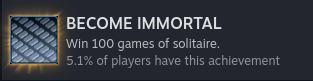

```
░       ░░░       ░░░░      ░░░░      ░░░░      ░░░   ░░░  ░  
▒  ▒▒▒▒  ▒▒  ▒▒▒▒  ▒▒  ▒▒▒▒  ▒▒  ▒▒▒▒▒▒▒▒  ▒▒▒▒  ▒▒    ▒▒  ▒  
▓  ▓▓▓▓  ▓▓       ▓▓▓  ▓▓▓▓  ▓▓  ▓▓▓   ▓▓  ▓▓▓▓  ▓▓  ▓  ▓  ▓  
█  ████  ██  ███  ███        ██  ████  ██  ████  ██  ██    █  
█       ███  ████  ██  ████  ███      ████      ███  ███   █  
                                                              
░       ░░░  ░░░░  ░░   ░░░  ░░░      ░░░  ░░░░  ░            
▒  ▒▒▒▒  ▒▒  ▒▒▒▒  ▒▒    ▒▒  ▒▒  ▒▒▒▒  ▒▒  ▒▒▒▒  ▒            
▓       ▓▓▓  ▓▓▓▓  ▓▓  ▓  ▓  ▓▓  ▓▓▓▓▓▓▓▓        ▓            
█  ████████  ████  ██  ██    ██  ████  ██  ████  █            
█  █████████      ███  ███   ███      ███  ████  █            
```

### Yet Another Shenzhen I/O Solitaire Solver

My attempt at solving the solitaire game in the game Shenzhen I/O.  


#### Features
- Works only with 1920x1080 resolution
- Has heuristics to guess the best moves
- Smart hashing of game states to avoid duplicates
- Can run games in loop indefinitely

#### How to run
- I wish you luck

#### Video demo
[](https://www.youtube.com/watch?v=YeCB-8BlMzY)
